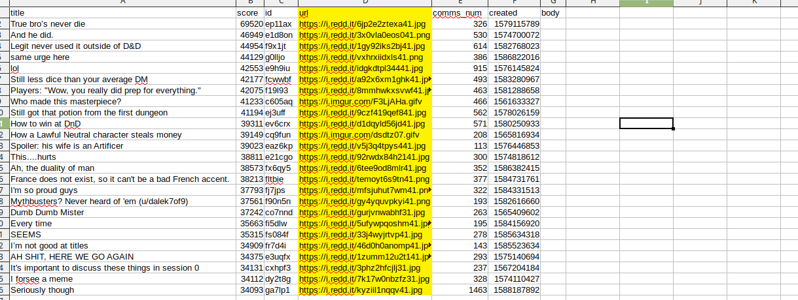

# Python Collab Project (DnD Meme Poster?)

Might be fun to collab on something light-hearted like a dnd meme poster. We all know Python, so I figured we could use that primarily. Thoughts? Their scrapy package is also choice. We can do any project I guess; might be fun to do a light hearted collab project. Could center it around DnD, games, discord/groupme shit, Fantasy Football, IDC.

